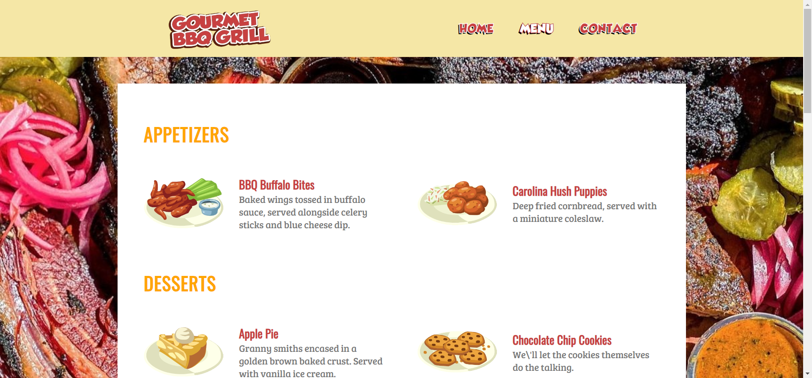

# Restaurant Page



Restaurant website for [The Odin Project](https://www.theodinproject.com/).

[Live Website](https://chiefwoods.github.io/restaurant-page/)  

[Source Repository](https://github.com/ChiefWoods/restaurant-page)

## Features

- Display restaurant information
- Generate menu dynamically from CSV files

## Built With

### Tools and Languages

- [](https://html5.org/)
- [](https://www.w3.org/Style/CSS/Overview.en.html)
- [](https://js.org/index.html)
- [](https://webpack.js.org/)
- [](https://eslint.org/)

### Libraries

- [Papa Parse](https://www.papaparse.com/)

## Getting Started

### Prerequisites

Update your npm package to the latest version.

```
npm install npm@latest -g
```

### Setup

1. Clone the repository
```
git clone https://github.com/ChiefWoods/restaurant-page.git
```
2. Install all dependencies
```
npm install
```
3. Bundle code
```
npx webpack
```

## Issues

View the [open issues](https://github.com/ChiefWoods/restaurant-page/issues) for a full list of proposed features and known bugs.

## Acknowledgements

### Resources

- [Shields.io](https://shields.io/)
- [Google Fonts](https://fonts.google.com/)
- [DaFont](https://www.dafont.com/)
- [Pictogrammers](https://pictogrammers.com/)
- [Restaurant City Wiki](https://restaurantcity.fandom.com/wiki/Restaurant_City_Wiki)

### Hosting

- [GitHub Pages](https://pages.github.com/)

## Contact

[chii.yuen@hotmail.com](mailto:chii.yuen@hotmail.com)
